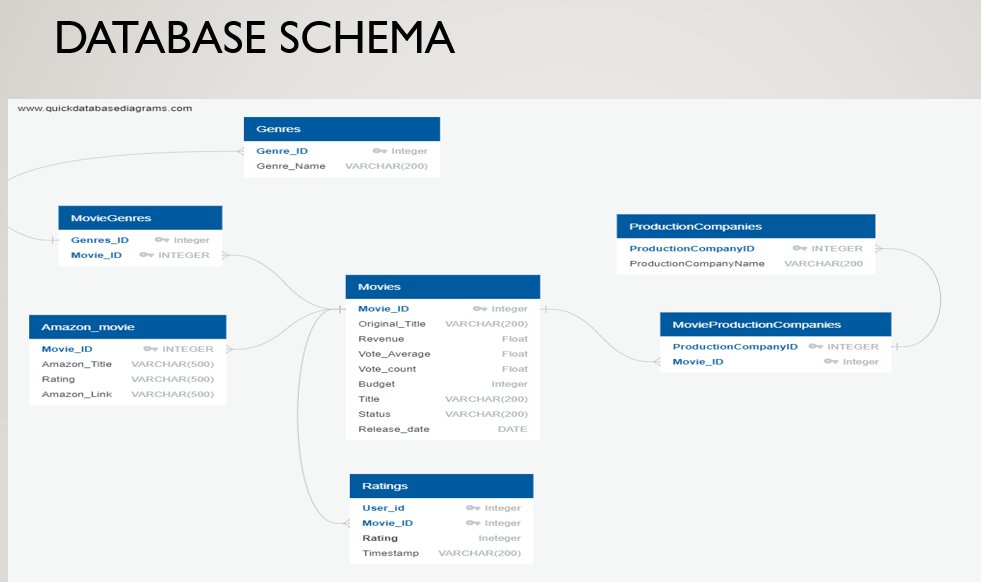

# Movies Data ETL Project

## An ETL project focuses around movies
    * Extract Movies and ratings csv data from www.Kaggle.com
    * Transformed the data using Python Pandas 
    * Web scrape Amazon search for Movie Title
    * Performed data modeling, created a Schema
    * Used SQL Alchemy to load the data SQL Lite
    * Query data to show results

